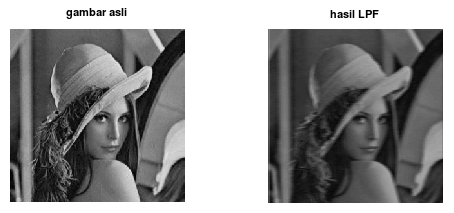

### Kelompok 3

- Julita Hasanah (2110131120005)
- Maysarah (2110131120006)
- Muhammad Haris (1810131210009)
- Trisena Wulandari (1910131320014)

---

<h1 align="center"><b>Low Pass Filtering</b></h1>

## **Pengertian**

Low pass filtering : Proses filter yang melewatkan komponen citra dengan nilai intensitas yang rendah dan meredam komponen citra dengan nilai intensitas yang tinggi.  
Low pass filtering digunakan untuk membuat citra menjadi lebih halus dan lebih blur. Efek pengaburan ini disebut dengan efek blurring.

 

## **Aturan-aturan dalam high-pass filter**

- Jumlah semua elemen kernel bernilai satu.
- Tinggi dan lebar kernel sama.
- Elemen kernel tidak ada yang bernilai negatif.
- Bobot dalam kernel bersifat simetris terhadap piksel pusat.

 

## **Kode Program Low Pass Filtering Menggunakan Octave**

1. Menggunakan fungsi conv2

 
 

- Output

 
 

 

2. Koding Secara Manual

 
 

- Output

 
 

 

---

<h1 align="center"><b>High Pass Filtering</b></h1>

## **Pengertian**

High Pass Filter (HPF) adalah proses filter yang mengambil citra dengan gradiasi intensitas yang tinggi dan perbedaan intensitas yang rendah akan dikurangi atau dibuang. High Pass Filtering adalah salah satu dari metode penajaman (sharpening).   
Tujuan utama dari proses penajaman ini adalah untuk menyoroti detail-detail halus dalam gambar atau untuk meningkatkan detail yang telah dikaburkan baik dalam kesalahan atau efek alami dari proses akuisisi citra tertentu.  
High-Pass Filter sering disebut juga sebagai filter penajaman tepi (edge sharpening) karena HPF digunakan dalam proses penajaman citra. 

 

## **Aturan-aturan dalam high-pass filter**

1. Koefisien penapis boleh negatif, nol, ataupun bernillai positif.
2. Total keseluruhan koefisiennya ialah bernilai 0 ataupun 1.
   - Apabila jumlah koefisiennya berjumlah = 0, maka setiap elemen yang rendah frekuensinya nilainya akan menurun.
   - Namun, apabila total dari koefisien adalah = 1, maka elemen yang memiliki frekuensi rendah nilainya tetap sama dengan nilai semula.

 

## **Kode Program High Pass Filtering Menggunakan Octave**

1. Menggunakan fungsi conv2

 
 

- Output

 
 

 
 

 

2. Koding Secara Manual

 
 

- Output

 
 

---

<h1 align="center"><b>High-Boost Filtering</b></h1>

## **Pengertian**

High-Boost Filtering merupakan salah satu bagian dari operasi yang dapat dilakukan untuk melakukan perbaikan citra.  
High-Boost Filtering bertujuan untuk menekankan komponen frekuensi tinggi yang mewakili detail gambar tanpa menghilangkan komponen frekuensi rendah (seperti sharpening). Filter high boost dapat digunakan untuk mengubah komponen frekuensi tinggi.  
High boost filter di susun oleh semua pass filter dan edge detection filter (Laplacian filter). Dengan demikian,  High boost filtering menekankan  edge dan menghasilkan image sharpener.

 

## **Kode Program High-Boost Filtering Menggunakan Octave**

1. Menggunakan fungsi

 
 
 

- Output

 
 

---

<h1 align="center"><b>Median Filter Image Processing</b></h1>

## **Pengertian**

Median Filtering adalah salah satu teknik filter yang mengurutkan nilai intensitas sekelompok pixel, kemudian mengganti nilai pixel yang diproses dengan nilai mediannya (nilai tengahnya). , metode ini digunakan dalam penghalusan citra (image smoothing) atau menghilangkan derau noise. Filter ini merupakan suatu filter non linear yang dikembangkan oleh Tukey.

 

## **Kode Program Median Filter Image Processing Menggunakan Octave**

1. Menggunakan fungsi

 
 
 

- Output

 
 

2. Koding Secara Manual

 
 
 

- Output

 
 

 

---

<h1 align="center"><b>Edge Detection</b></h1>

## **Pengertian**

Deteksi tepi (edge detection) pada suatu citra adalah suatu pendekatan untuk memeroleh tepi-tepi/garis batas dari objek di dalam citra tersebut. Tepi objek bermanfaat untuk segmentasi, registrasi, dan identifikasi antar objek pada citra.
  
Sutu titik (x, y) dapat dikatakan sebagai tepi jika terjadi perubahan nilai intensitas derajat keabuan (grayscale) yang tinggi dalam jarak yang dekat dengan tetangganya.
  

Tujuan dari deteksi tepi antara lain :

- Meningkatkan penampakan garis batas atau objek dalam citra
- Mengekstraksi representasi gambar garis-garis di dalam citra.
- Mengenali objek di dalam citra (image recognition).

 

Adapun operator turunan pertama yaitu Metode Robert, Sobel, dan Prewitt
  

## **Kode Program Edge Detection Menggunakan Octave**

1. Menggunakan Fungsi

- Opereator Sobel

 
 

- Output

 
 

- Operator Prewitt

 
 

- Output

 
 

- Operator Robert

 
 

- Output

 
 

 

2. Koding Secara Manual

 
 
 

- Output

 
 

 
